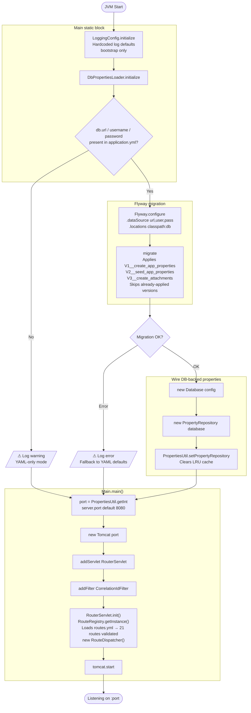
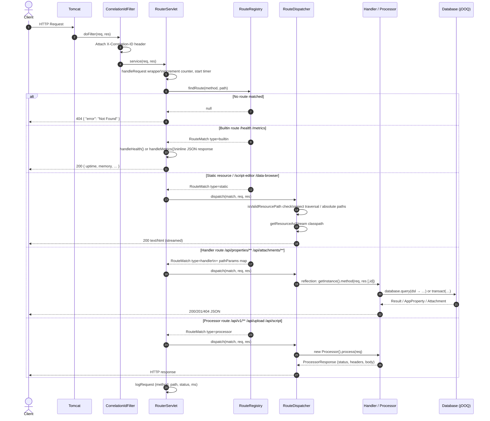

# Application Flow Diagrams

## App Startup Flow



---

## HTTP Request Flow



---

## Component Responsibilities

| Layer | Class | Role |
|---|---|---|
| Entry point | `Main` | Starts Tomcat, wires startup sequence |
| Bootstrap | `LoggingConfig` | Configures SLF4J/Logback with hardcoded defaults |
| Bootstrap | `DbPropertiesLoader` | Runs Flyway, creates `Database` + `PropertyRepository` |
| Properties | `PropertiesUtil` | LRU cache → DB → YAML three-level property lookup |
| Routing | `RouteRegistry` | Loads `routes.yml`, validates, matches method + path |
| Routing | `RouteDispatcher` | Resolves handler/processor by name, invokes via reflection |
| Servlet | `RouterServlet` | Wraps all requests; handles builtins inline |
| Filter | `CorrelationIdFilter` | Injects `X-Correlation-ID` for structured logging |
| DB wrapper | `Database` | `query()` / `transact()` / `openConnection()` over jOOQ |
| DB | `PropertyRepository` | CRUD for `app_properties` via jOOQ DSL |
| Storage | `DatabaseAttachmentStorage` | Chunk-streamed BYTEA storage; cursor-based retrieval |
| Storage | `LocalFileSystemStorage` | Filesystem fallback, 1 MB chunked writes |
| Handlers | `PropertiesHandler` `AttachmentHandler` `ApiHandler` | REST endpoints |
| Processors | `ScriptProcessor` `ModuleProcessor` `FileUploadProcessor` `TemplateProcessor` | Request processors |
```
